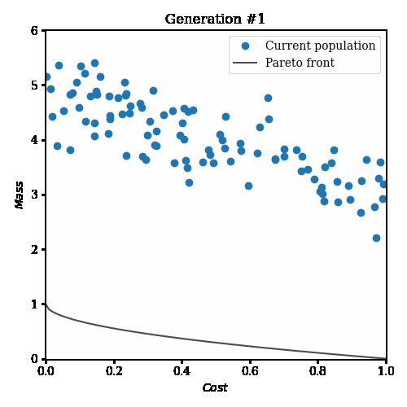

# Multi Objective Optimisation with PYMOO

[](https://mybinder.org/v2/gh/PierreExeter/pymoo-tutorials/master)

This repository contains some tutorials on [PYMOO](https://www.pymoo.org/), a multi-objective optimisation framework in Python. Most of the code in inspired from the [documentation](https://www.pymoo.org/).



## Installation

Install the repository and the Conda environment.

```bash
git clone https://github.com/PierreExeter/pymoo-tutorials.git
conda env create -f environment.yml
conda activate pymoo
```

## Run the notebooks

```bash
jupyter notebook
```
